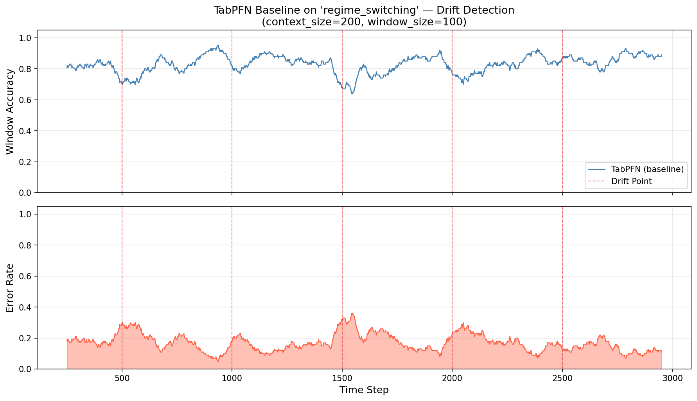
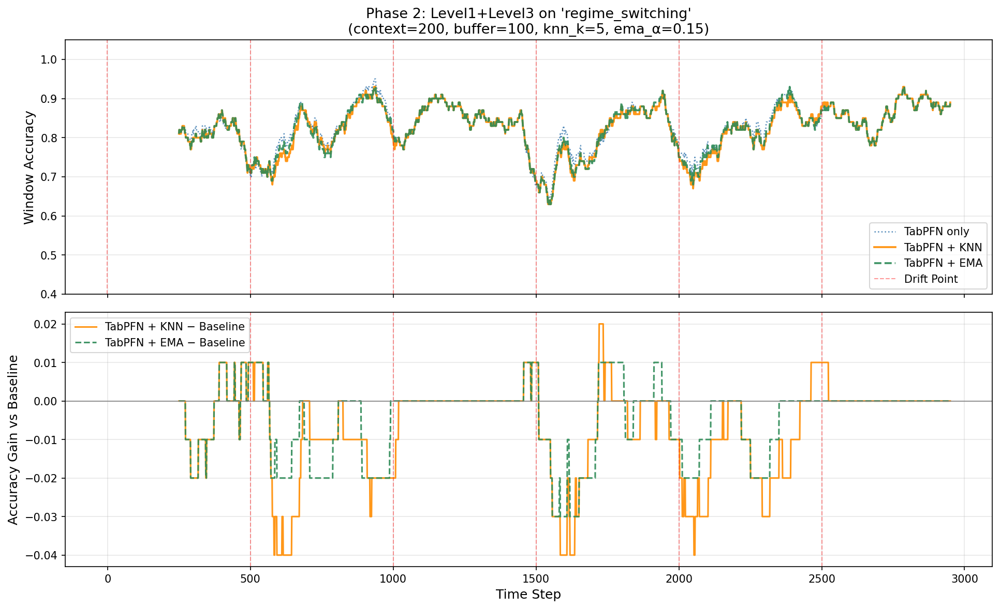

# 多时间尺度时序学习系统 — 阶段性进展报告

**数据集**：`regime_switching`（体制切换，突变型漂移）
**任务**：二分类，Prequential（先预测后更新）评估协议
**硬件**：CPU (MacBook)

---

## 已完成模块

| 模块 | 文件 | 说明 |
|------|------|------|
| 合成数据生成 | `src/data/synthetic.py` | 3 种漂移类型生成器 |
| 时序窗口加载器 | `src/data/temporal_loader.py` | 滑动上下文窗口 |
| Level 1 慢速先验 | `src/models/slow_prior.py` | 冻结 TabPFN 包装器 |
| FIFO 工作记忆缓冲区 | `src/memory/buffer.py` | KNN / EMA 查询支持 |
| Level 3 快速校正器 | `src/models/fast_corrector.py` | 零参数残差补偿 |
| 评估指标 | `src/utils/metrics.py` | 窗口准确率、适应速度等 |
| 单元测试 | `tests/` (3 个文件，60+ 条测试) | 全部通过 |

---

## Phase 1：TabPFN 基线（Level 1）

**实验参数**：`n_samples=5000, regime_length=500, context_size=300, window_size=100, n_estimators=4`
**漂移点**（5 个）：t = 500, 1000, 1500, 2000, 2500

### 数值结果

| 指标 | 数值 |
|------|------|
| 总体 Prequential 准确率 | **82.96%** |
| 漂移前平均准确率 | **87.20%** |
| 漂移后平均准确率 | **74.60%** |
| 平均适应速度 | **61.2 步** |
| 窗口准确率最低点 | ~64%（漂移后第 1 窗口） |

### 结论

TabPFN 在稳定体制下准确率高达 87%，但每次漂移点后准确率骤降约 12–13 个百分点，需平均 61 步才能恢复。这验证了"TabPFN 对概念漂移脆弱"的核心动机。

### 结果图

> 上图：滑动窗口准确率随时间变化；红色虚线为 5 个漂移点位置。
> 下图：平滑后的逐步误差率，漂移点处误差骤增清晰可见。

---

## Phase 2：Level 1 + Level 3（快速校正器）

**实验参数**：`n_samples=3000, regime_length=500, context_size=200, buffer_size=100, knn_k=5, ema_α=0.15`
**漂移点**（5 个）：t = 500, 1000, 1500, 2000, 2500
**评估步数**：2800 步（全量）

### 数值结果

| 配置 | 总体准确率 | 窗口均值 | 窗口最低 | 窗口最高 |
|------|-----------|---------|---------|---------|
| TabPFN only (baseline) | **82.96%** | 82.91% | 64.00% | 95.00% |
| TabPFN + KNN corrector | 82.29% | 82.21% | 63.00% | 93.00% |
| TabPFN + EMA corrector | 82.50% | 82.43% | 63.00% | 93.00% |

### 观察

- **EMA > KNN**：EMA 是时序全局均值，与体制级偏移的信号特性更匹配；KNN 空间查找引入额外检索噪声
- **两者均未超越 baseline**：体制突变时缓冲区存储的旧体制误差在漂移后持续施加错误校正，形成约 50 步的滞后期
- 窗口准确率标准差：KNN (6.07%) > EMA (6.01%) > baseline (5.72%)，说明校正器在漂移周边增加了预测波动

### 结果图

> 上图：三种配置的窗口准确率曲线对比；红色虚线为漂移点。
> 下图：KNN 和 EMA 相对于 baseline 的准确率差值（Gain），正值表示超越 baseline。
