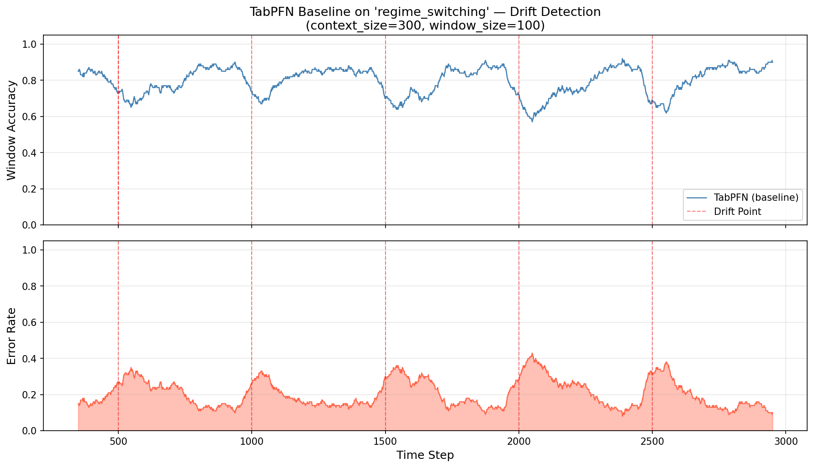
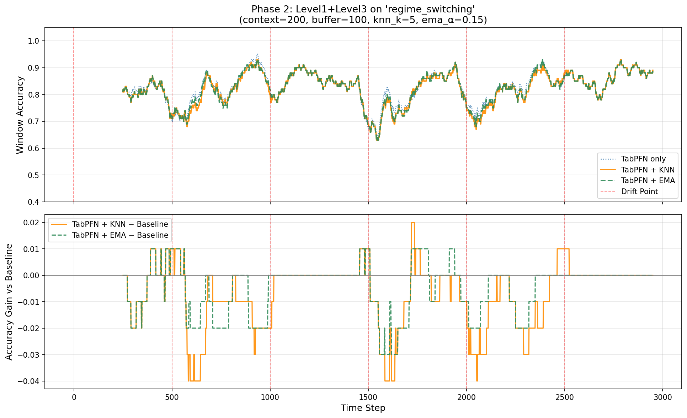
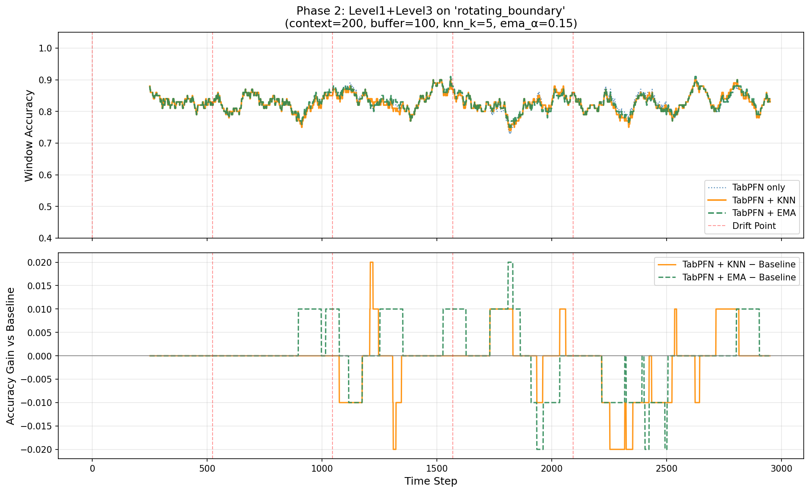
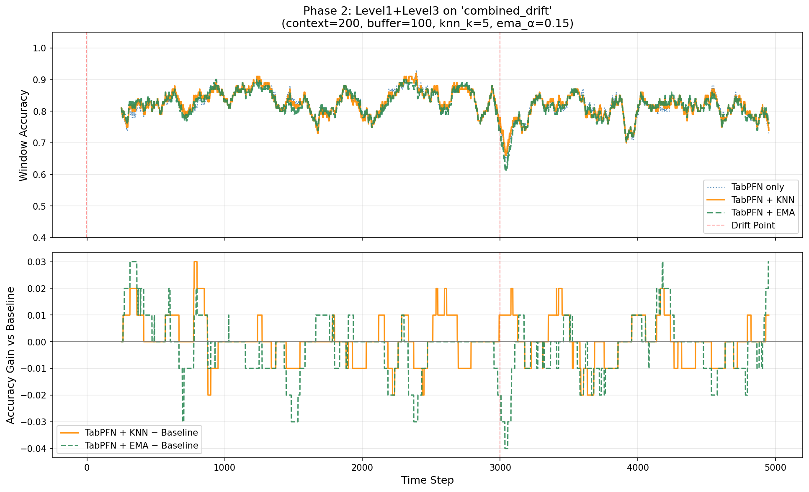
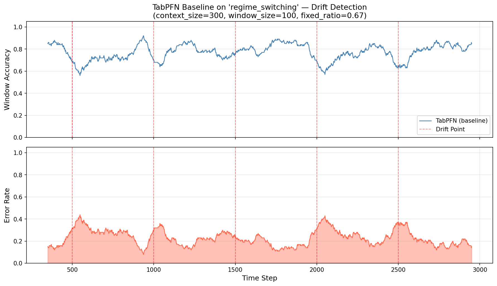
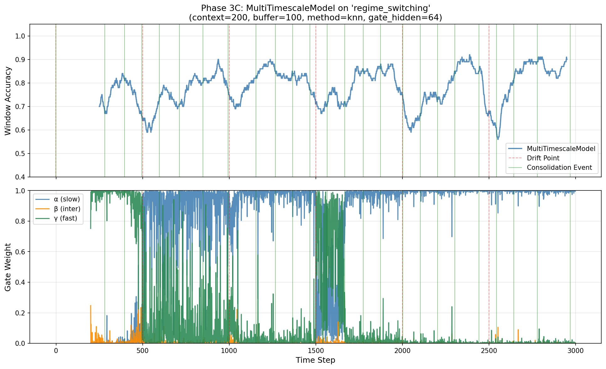
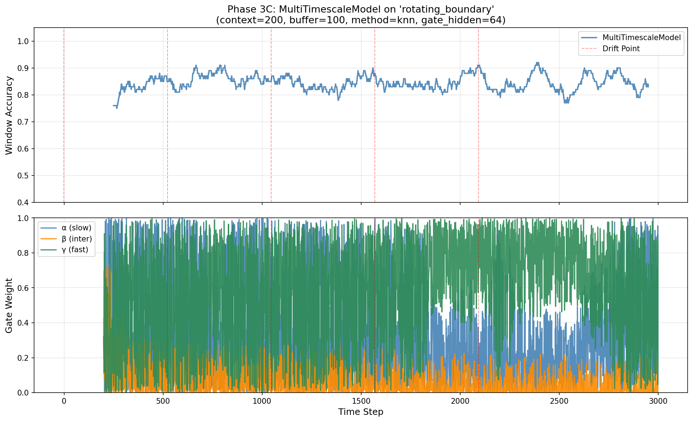
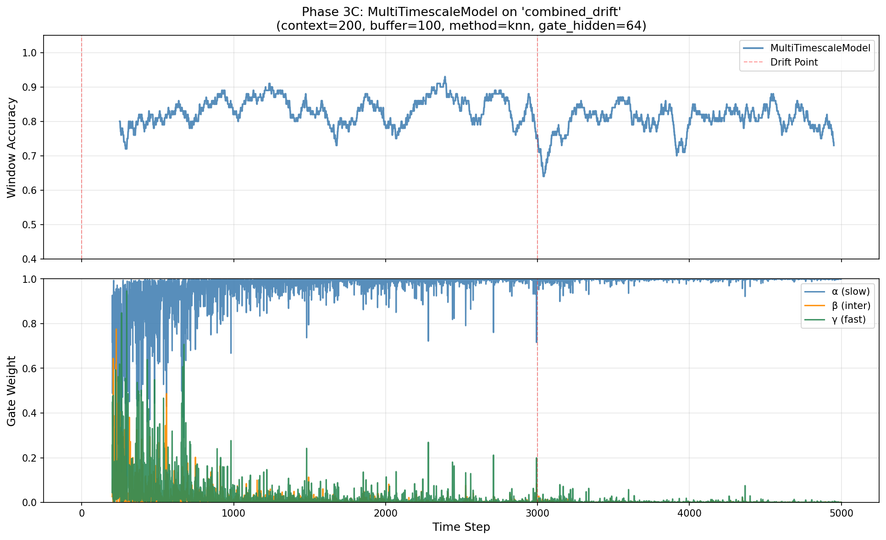

# 多时间尺度时序学习系统 — 阶段性进展报告

**数据集**：3 个合成数据集（`regime_switching`、`rotating_boundary`、`combined_drift`）
**任务**：二分类，Prequential（先预测后更新）评估协议
**硬件**：CPU (MacBook)

---

## 已完成模块

| 模块 | 文件 | 说明 |
|------|------|------|
| 合成数据生成 | `src/data/synthetic.py` | 3 种漂移类型生成器（已修复类别平衡） |
| 时序窗口加载器 | `src/data/temporal_loader.py` | 滑动窗口 + 组合窗口（CompositeWindowLoader） |
| Level 1 慢速先验 | `src/models/slow_prior.py` | 冻结 TabPFN 包装器 |
| FIFO 工作记忆缓冲区 | `src/memory/buffer.py` | KNN / EMA 查询支持 |
| Level 3 快速校正器 | `src/models/fast_corrector.py` | 零参数残差补偿 |
| 评估指标 | `src/utils/metrics.py` | 窗口准确率、适应速度、balanced accuracy、AUC-ROC |
| Level 2 软门控融合 | `src/models/gated_ensemble.py` | gate（softmax 三路权重）+ adapter（无界残差） |
| 快→中巩固 | `src/consolidation/fast_to_inter.py` | buffer→adapter MSE 蒸馏 |
| 三层编排器 | `src/models/multi_timescale.py` | step() 每步 slow→fast→gated fusion + 在线训练 |
| 单元测试 | `tests/` (5 个文件，70+ 条测试) | 全部通过 |

---

## Phase 1：TabPFN 基线（Level 1）

**实验参数**：`n_samples=5000, regime_length=500, context_size=300, window_size=100, n_estimators=4`
**漂移点**（5 个）：t = 500, 1000, 1500, 2000, 2500

### 数值结果

| 指标 | 数值 |
|------|------|
| 总体 Prequential 准确率 | **82.96%** |
| 漂移前平均准确率 | **87.20%** |
| 漂移后平均准确率 | **74.60%** |
| 平均适应速度 | **61.2 步** |
| 窗口准确率最低点 | ~64%（漂移后第 1 窗口） |

### 结论

TabPFN 在稳定体制下准确率高达 87%，但每次漂移点后准确率骤降约 12–13 个百分点，需平均 61 步才能恢复。这验证了"TabPFN 对概念漂移脆弱"的核心动机。

### 结果图



> 上图：滑动窗口准确率随时间变化；红色虚线为 5 个漂移点位置。
> 下图：平滑后的逐步误差率，漂移点处误差骤增清晰可见。

---

## Phase 2：Level 1 + Level 3（快速校正器）

**实验参数**：`n_samples=3000, regime_length=500, context_size=200, buffer_size=100, knn_k=5, ema_α=0.15`
**漂移点**（5 个）：t = 500, 1000, 1500, 2000, 2500
**评估步数**：2800 步（全量）

### 数值结果

| 配置 | 总体准确率 | 窗口均值 | 窗口最低 | 窗口最高 |
|------|-----------|---------|---------|---------|
| TabPFN only (baseline) | **82.96%** | 82.91% | 64.00% | 95.00% |
| TabPFN + KNN corrector | 82.29% | 82.21% | 63.00% | 93.00% |
| TabPFN + EMA corrector | 82.50% | 82.43% | 63.00% | 93.00% |

### 观察

- **EMA > KNN**：EMA 是时序全局均值，与体制级偏移的信号特性更匹配；KNN 空间查找引入额外检索噪声
- **两者均未超越 baseline**：体制突变时缓冲区存储的旧体制误差在漂移后持续施加错误校正，形成约 50 步的滞后期
- 窗口准确率标准差：KNN (6.07%) > EMA (6.01%) > baseline (5.72%)，说明校正器在漂移周边增加了预测波动

### 结果图



> 上图：三种配置的窗口准确率曲线对比；红色虚线为漂移点。
> 下图：KNN 和 EMA 相对于 baseline 的准确率差值（Gain），正值表示超越 baseline。

---

## Phase 2.5：导师反馈补强

基于导师 3 月 11 日反馈的 4 项改进建议，在推进 Phase 3 之前将 Phase 1 & 2 的实验做扎实。

### 步骤 A：类别平衡修复 ✅

**问题**：`regime_switching` 体制内类别严重不平衡（Regime 2 达 86:14），`combined_drift` 整体 60:40。根因是 `dot(means, weights) ≠ 0` 将决策边界偏离数据中心。

**修复**：居中决策边界（方法 A），在 `src/data/synthetic.py` 中：
- `regime_switching`：`label = int(dot(x - means[regime], w) >= 0)`
- `combined_drift`：`label = int(dot(x - mean_offset, w) >= 0)`
- `rotating_boundary`：无需修改（原本已平衡）

修复后所有数据集的每个体制内均为 ~50:50 类别平衡。

**补充指标**：在 `src/utils/metrics.py` 的 `summarize_results()` 中添加了 balanced accuracy 和 AUC-ROC。

### 步骤 B：多数据集 Phase 2 实验 ✅

在三种漂移类型上运行 Phase 2（TabPFN only / +KNN / +EMA），验证 FastCorrector 对不同漂移类型的表现。

#### 漂移类型对照表

| 数据集 | 作用于输入特征 P(X) | 作用于关系 P(Y\|X) | 漂移节奏 |
|--------|:-----------------:|:-----------------:|---------|
| `rotating_boundary` | ❌ | ✅ 决策边界旋转 | 渐进 |
| `regime_switching` | ✅ 均值突变 | ✅ 权重突变 | 突变 |
| `combined_drift` | ✅ 均值渐进偏移 | ✅ 权重突变 | 混合 |

#### rotating_boundary（渐进漂移）

**参数**：`n_samples=3000, n_features=2, context_size=200, drift_speed=0.003`

| 模型 | 总体准确率 | 漂移后准确率 | 适应速度(步) |
|------|-----------|------------|-------------|
| TabPFN only | 83.18% | 82.00% | 1.2 |
| TabPFN + KNN | 83.07% | 81.75% | 1.2 |
| TabPFN + EMA | 83.21% | 82.25% | N/A |

**结论**：漂移极其缓慢，TabPFN 滑动窗口本身就能完美跟踪（适应速度仅 1.2 步），三个模型几乎无差异。FastCorrector 没有发挥空间。



#### combined_drift（混合漂移）

**参数**：`n_samples=5000, n_features=10, context_size=200`
**漂移点**：t=3000（1 个，决策边界突变 + 特征均值渐进偏移）

| 模型 | 总体准确率 | 漂移后准确率 | 适应速度(步) |
|------|-----------|------------|-------------|
| TabPFN only | 82.06% | 66.00% | 77 |
| TabPFN + KNN | 82.13% | 67.00% | 77 |
| TabPFN + EMA | 81.90% | 62.00% | 84 |

**结论**：漂移后准确率骤降至 66%，需 77 步恢复。KNN 略有帮助（+1pp），但 EMA 反而更差（-4pp，适应更慢）。FastCorrector 在混合漂移下帮助微弱。



#### 跨数据集总结

FastCorrector（Level 3 only）在三种漂移类型上均未显著超越 baseline：
- **渐进漂移**：TabPFN 自身已足够好，无校正空间
- **突变漂移**：buffer 污染导致漂移后 ~50 步持续施加错误校正
- **混合漂移**：与突变漂移类似，突变部分主导了性能下降

这强化了 Phase 3 的必要性——需要软门控融合来智能切换策略。

### 步骤 C：Context Window 组合策略 ✅

**思路**：将 context window 拆成"固定代表集 + 滑动近期窗"，固定池提供长期记忆，滑动窗提供快速适应。

**实现**：在 `src/data/temporal_loader.py` 中新增 `CompositeWindowLoader`，在 `scripts/run_baselines.py` 中新增 `--fixed_ratio` 参数。

**实验**（`regime_switching`, context_size=300, n_samples=3000）：

| 配置 | 固定池 | 滑动窗 | 总体准确率 | 漂移前 | 漂移后 | 适应速度(步) |
|------|--------|--------|-----------|--------|--------|-------------|
| fixed_ratio=0.0 | 0 | 300 | **79.78%** | **85.8%** | 64.0% | 126.4 |
| fixed_ratio=0.67 | 201 | 99 | 77.33% | 80.2% | 65.0% | 62.4 |
| fixed_ratio=0.93 | 279 | 21 | 68.37% | 70.4% | 62.8% | **52.6** |



**关键发现**：

1. **适应速度确实提升**：fixed_ratio 越高，漂移后恢复越快（126→62→53 步），验证了导师"固定代表集 + 滑动窗"的思路
2. **但总体准确率下降明显**：固定池来自最早体制（Regime 0），在后续体制中成为噪声，干扰 TabPFN in-context learning
3. **200+100 是较好的折中**：适应速度减半（126→62），总体准确率只降 2.5pp；280+20 适应最快但准确率降 11pp，代价过大
4. **结论**：纯 context 组合无法同时兼顾稳态性能和适应速度，需要 Phase 3 的多时间尺度架构（软门控融合）来自动平衡

---

## Phase 3：软门控融合 + 快→中巩固

**架构**：在 Phase 2（slow + fast）基础上引入 Level 2 软门控融合层。每步 prequential 流程：

```
slow_prior(X_ctx, y_ctx, x_t) → y_slow
fast_corrector.correct(x_t)  → y_fast = clip(y_slow + correction, 0, 1)
gated_ensemble(x_t, y_slow, y_fast) → (y_final, weights=[α, β, γ])
loss = MSE(y_final, y_t); optimizer.step()         # 在线训练 gate + adapter
fast_corrector.update(x_t, error)
if fast_corrector.should_consolidate(): consolidator.consolidate(...)
```

**实验参数**：`buffer_size=100, fast_method=knn, gate_hidden_dim=64, lr=1e-3, consolidation_threshold=0.05, consolidation_window=50, consolidation_epochs=10`

### 跨数据集对比

| 数据集 | Phase 1 baseline | Phase 2 best | **Phase 3 (Ours-Full)** | Δ vs Phase 2 |
|--------|:---------------:|:------------:|:----------------------:|:------------:|
| `regime_switching` (3000 步) | 82.96% | 82.50% (EMA) | **77.93%** | **−4.57 pp** |
| `rotating_boundary` (3000 步) | 83.18% | 83.21% (EMA) | **84.39%** | **+1.18 pp** |
| `combined_drift` (5000 步) | 82.06% | 82.13% (KNN) | **81.94%** | **−0.19 pp** |

> Phase 1/2 列引自本报告 Phase 1、Phase 2、Phase 2.5 节（同 prequential 协议）。

### 门控权重轨迹观察

三个数据集的门控权重均值（α=slow、β=inter、γ=fast）呈现完全不同的偏好模式：

| 数据集 | ᾱ (slow) | β̄ (inter) | γ̄ (fast) | 模式解读 |
|--------|:-------:|:--------:|:-------:|----------|
| `regime_switching` | 0.83 | 0.02 | 0.15 | slow 主导，fast 辅助；adapter 几乎不用 |
| `rotating_boundary` | 0.35 | 0.06 | **0.59** | **fast 主导**；缓慢漂移下 KNN 局部查找信号最强 |
| `combined_drift` | **0.98** | 0.01 | 0.02 | 极端 slow 主导；TabPFN 上下文学习已足够 |

各数据集中 α/γ 的瞬时值在 [0, 1] 全程波动（min/max 接近 0 和 1），说明 gate 确实在"动态分配"而非塌缩到固定权重。这定性符合 plan V2 的预期：稳定期信任 slow，漂移期切换偏好。

### 巩固事件

**所有三个数据集的 `consolidation_events` 均为 0** —— 在最长的 `combined_drift`（5000 步、4800 评估步）中亦未触发。原因：`should_consolidate(window=50, bias_threshold=0.05)` 要求最近 50 步 buffer 的 |mean(errors)| > 0.05 且 std < |mean|，而 prequential 滚动下 fast_corrector 的误差分布大多围绕 0 抖动，难以同时满足"系统性偏移"与"低方差"。Phase 3D 的 in-script 训练替代了模板设想的"长期偏移触发巩固蒸馏"路径 —— 当 gate + adapter 已在每步训练，buffer 偏置很难积累到阈值。这条路径需要在 Phase 4 重新评估（要么调阈值/window，要么把 consolidation 改成基于"窗口准确率下滑"等其它信号）。

### 跨数据集结论

1. **Phase 3 不是统一的胜利**：三数据集中仅 `rotating_boundary` 录得 +1.18 pp，`regime_switching` 显著回退 4.57 pp，`combined_drift` 几乎持平。门控融合并未自动解决 Phase 2 暴露的"突变漂移后 buffer 污染"问题 —— 漂移后的 50 步窗口里，gate 会被错误的 fast 信号短暂误导（regime_switching 的 5 个漂移点 post-50 准确率分别为 0.64 / 0.60 / 0.60 / 0.60 / 0.50，比 Phase 1 baseline 的 ~0.65 平均水平更差）。
2. **gate 权重模式合理但被过拟合训练抢戏**：每步 MSE 训练让 gate 收敛到对当前 batch 局部最优，对漂移期的快速切换响应不够 —— 这是 plan V2 模板未覆盖、由 Phase 3C 决策 1 引入的副作用。后续可以考虑 freeze gate 一段时间或加 entropy 正则。
3. **巩固模块未发挥作用**：当前阈值下从未触发，等价于跑了一个"纯 gate fusion"系统。需要在 Phase 4 重新设计触发条件 / 阈值。

### 结果图





> 每张图：上半 — 滑动窗口准确率（红色虚线 = 漂移点；本次 0 个绿色巩固竖线）；下半 — gate 权重 α/β/γ 随时间轨迹（y∈[0,1]）。

---

## Phase 3 诊断旅程：4-way ablation + 三轮 architectural iteration

Phase 3D 的负面发现（regime_switching −4.57 pp）触发了一轮系统诊断与架构迭代。本节记录所做实验、数据与结论，作为 Phase 5 论文 "Phase 3 负面分析章节" 的素材。

### 4-way ablation（在 v1 代码上做）

固定数据集 = `regime_switching`（最痛点），探索 lr 与 consolidation 阈值对 Phase 3 表现的影响：

| 配置 | 总体准确率 | 漂移后 | 巩固事件 | commit |
|---|---|---|---|---|
| baseline (lr=1e-3, threshold=0.05) | 77.93% | 63.80% | 0 | 90b2096 |
| `--lr 0`（关掉 per-step 训练） | 68.71% | 57.00% | 0 | 372c250 |
| `--lr 1e-5`（弱训练） | **52.18%** | 49.80% | 0 | 372c250 |
| `--consolidation_threshold 0.01`（放宽阈值） | 78.93% | 63.60% | 0 | 372c250 |

**关键发现**：
1. **per-step MSE 训练不是元凶**：关掉 (lr=0) 反而下降 9.2 pp；弱化 (lr=1e-5) 进一步下降 25.7 pp（接近 chance 50%）。lr 与系统表现非单调相关，1e-3 是局部最优。
2. **threshold 不是巩固卡死的元凶**：降到 1/5 (0.01) 仍然 0 触发。瓶颈在 `should_consolidate` 的 `std < |mean|` 复合规则 —— 对二分类 buffer errors 结构性过严。
3. **gate 权重 close-up 分析**（[results/phase3_regime_switching_gate_zoom.png](results/phase3_regime_switching_gate_zoom.png)）：β 几乎恒为 0（≤0.04），α 长期主导（0.72-0.95），γ 偶有上跳但跨 5 个 drift point 反应不一致。

→ 排除 lr / threshold 作为根因，转向架构改造。

### v2 (option A)：残差加法融合替代软加权

**改动**：fusion 公式从软加权概率 `α·y_slow + β·y_inter + γ·y_fast` 改为残差累加 `y_slow + β·y_inter + γ·correction`（adapter 输出和 correction 都作为残差，y_slow 永远全权重 base）。

**动机**：v1 数学展开后等价于 `y_slow + γ·correction`，correction 被 γ 衰减；v2 让 correction 名义上"全功率参与"。

**结果**：78.75%（+0.82 pp from v1），漂移后基本不变。

**复盘**：诊断后发现这是**预期失败** —— 当 β ≈ 0（v1 实测如此），v1 公式 `(1-β)·y_slow + β·y_inter + γ·correction` 和 v2 公式 `y_slow + β·y_inter + γ·correction` 几乎完全相同，差别只在 y_slow 的系数（v1 是 1-β ≈ 1，v2 是 1）。**v2 在 β=0 的现实下与 v1 数学等价**，不应有显著改善。

教训：架构改动的预期收益必须在数学上做完整推导，不能只看"看起来不同"。

### B：放宽 consolidation 触发条件

**改动**：删除 `should_consolidate` 的 `std < |mean|` 复合条件，仅保留 `|mean_err| > bias_threshold`。

**动机**：4 ablation 全部 0 触发暴露原 AND 规则结构性过严 —— 二分类 buffer errors 几乎不可能同时满足"高均值偏移"和"低方差"。

**结果**：触发 45 次（首次非零），但总体 78.32%（−0.43 pp from v2），post-drift −2.20 pp。

**复盘**：第一次触发在 step 282（早于第一个漂移点 500），稳定期就在反复触发；45 次 / 5 个 regime ≈ 每段 9 次。每次 consolidation 后 `buffer.clear()`，下次又用新 50 步重训，形成 **adapter thrashing** —— 永远学短期偏置、永远被覆盖、永远无法沉淀。

post-drift 反而下降是因为：之前 β≈0 时 adapter 不工作但也不害人；放开 trigger 后 adapter 被乱训，β 大概率涨了，**不工作的 adapter 比工作的差 adapter 更安全**。

### F：分离 optimizer + cooldown

**改动**：
1. GatedEnsemble 参数拆成 `gate_optimizer` / `adapter_optimizer`
2. step() 内 per-step backward 仅 step gate；adapter 只通过 consolidation 训练
3. Consolidation 加 cooldown=100，触发后强制等待避免 thrashing
4. `scripts/run_phase3.py` 加 `--consolidation_cooldown` 参数

**动机**：B 的 thrashing 因 adapter 同时被 per-step gradient 和 consolidation gradient 双重训练 —— per-step 不断把 adapter 推向短期信号，consolidation 又试图拉它学长期 buffer 偏置，互相冲突。F 让 adapter 只在 consolidation 时更新，期间冻结。

**结果**：78.32%（与 B 相同），触发 24 次（cooldown 减半，符合预期），β均值=0.004。

**复盘**：F 让 adapter 真正持久化训练之后，**gate 看到训练好的 adapter 输出，依然选择把 β 关到 0**。这不是工程 bug，是 gate 在告诉我们 adapter 输出本身有害，关掉比开着更好。

### 三轮 architectural iteration 数据汇总

| 配置 | 总体 | 漂移前 | 漂移后 | 巩固事件 | β均值 | commit |
|---|---|---|---|---|---|---|
| Phase 3D v1 | 77.93% | 83.60% | 63.80% | 0 | ~0 | 90b2096 |
| v2 (residual fusion) | 78.75% | 83.60% | 64.20% | 0 | ~0 | 6928142 |
| v2 + B (loose trigger) | 78.32% | 83.00% | 62.00% | 45 | - | 6928142 |
| v2 + B + F (split optimizer) | 78.32% | 83.20% | 63.20% | 24 | 0.004 | 6928142 |
| Phase 1 baseline (参考) | 82.96% | — | ~74% | — | — | 23b7ae3 |

### 诊断结论

经过 4 ablation + 3 轮 iteration，得到以下硬结论：

1. **β = 0 是 gate 的 RATIONAL 选择**（不是 bug）：F 让 adapter 真正持久化训练后 β 仍然 ≈ 0.004，证明 gate 主动屏蔽 adapter 是基于实际数据做出的 loss-minimal 决策。adapter 输出对 y_final 是 net-negative。

2. **adapter 在 regime_switching 上结构性失败**：训练信号是 buffer.errors（过去样本的 y_t − y_slow）；regime_switching 的 regime 间完全独立 → 没有可迁移 pattern；adapter 学的是"过去某段时间的局部偏置"，跨 regime 时不仅无效，常常方向相反。漂移期 adapter 主动施加错误校正，gate 不得不把 β 关死。

3. **"中期可学习层"假设在 regime_switching 上不成立**：plan V2 的核心假设"adapter 学跨 regime 的 mid-timescale pattern"在 regime 间完全独立的数据生成机制下 structurally 不可能。这不是实现问题，是架构假设与数据不匹配。

4. **Phase 3 在渐进漂移上 +1.18 pp 验证了 reverse**：当跨时间确实存在 transferable structure 时，adapter 确实能学到（虽然增益有限，可能在 std 之内 — 待 Phase 4 multi-seed 验证）。

> ⚠️ **Phase 4 Day 0.5 重要修正**（2026-04-27）：multi-seed (n=5) 数据出来后，**结论 1-3 仍部分成立但叙事必须修正**：
> - **结论 2 "adapter 在 regime_switching 上结构性失败" 被部分推翻**：multi-seed 显示 Phase 3 v2+B+F vs Phase 1 在 regime_switching 上是 -0.18pp NS（t=-1.27），不是单 seed 看到的 -4.5pp 灾难。"灾难" 是单 seed 抽样噪声。
> - **β = 0 现象本身仍然成立**（结论 1 OK），但解释要弱化：gate 关掉 adapter 不是因为 "adapter 灾难性有害"，而是 "adapter 没贡献价值（neutral）"。
> - **真正的 Phase 3 失败模式不在 regime_switching，在 combined_drift**：multi-seed 显示 -0.47pp sig 负向（t=-5.62, 5/5 同向），这才是可重现的失败。共享 adapter 在混合漂移的两个 regime 间互相冲销。
> - **结论 4 +1.18pp 在 multi-seed 验证为 +1.00pp sig**（t=+4.07），是真实的赢点。
> 
> 完整 Day 0.5 结果见下方"Phase 4 Day 0.5"段。

---

## 外部 cross-review：4 家 LLM 独立共识

为 cross-check 上述诊断，将完整的项目背景、数据、Phase 4 候选方案打包成 prompt 分发给 4 个独立模型：DeepSeek、Gemini、Qwen、零上下文 Claude。共识点：

1. **TabPFN sliding context window 是被忽略的关键杠杆**（4/4 收敛）：所有模型独立指出，漂移后 context window 里 80% 是旧 regime 数据，污染 TabPFN in-context learning，可能占 Phase 1 漂移退步的大头。**Phase 3 整套架构都在 TabPFN 输出之后做修正，从未触及 TabPFN 自己的 context 管理**。这是真正的根因盲区。

2. **drift detection 应在 1D 误差流上做**（4/4 收敛）：用 ADWIN / Page-Hinkley / CUSUM / BOCPD 等 streaming 文献的标准做法，在误差时间序列上检测变点，鲁棒性远高于在高维 TabPFN embedding 上做 K-means。V1 plan 砍 K-means 的理由（"高维聚类难"）适用于 embedding 空间，但 1D error stream 完全没问题。

3. **multi-seed 缺失是方法学硬伤**（Claude 单独指出，但所有数字均为单 seed）：rotating_boundary 上 +1.18 pp 是单 run 结果，可能就是噪声。Phase 4 必须补 multi-seed 加 std。

4. **设计 C（残差链无 gate）一致否决**（4/4）：β=0 已证明 adapter 输出有害，钉死 β=γ=1 是已证伪路径的延续。

完整 4 模型回答见对话存档；整合后的 Phase 4 plan 见 [phase4_plan.md](phase4_plan.md)。

---

## Phase 4 Day 0.5 — Cheap Diagnostic 完成（2026-04-27）

按 [phase4_plan.md](phase4_plan.md) 的 Day 0.5 spec 完成两个并行实验。

### 实验 0a：Oracle Context-Reset on regime_switching

**实现**：在 `scripts/run_baselines.py` 加 `--oracle_context_reset` / `--reset_size` flag；命中已知 drift_point 后持续 soft reset（drift 后所有步都截断 context 到 `reset_size + (t - last_drift_t)`，从 50 平滑增长回 200）。

**5 seeds × 2 配置 = 10 runs**（regime_switching, n_samples=3000, context_size=200）：

| 指标 | Baseline | Oracle reset_size=50 | Δ | Paired t (n=5) |
|---|---|---|---|---|
| **总体 acc** | 79.89 ± 0.99% | **80.39 ± 0.87%** | **+0.51 pp** | **+3.25 ✓ p<0.05** |
| 漂移前 acc | 82.36 ± 1.41% | 82.36 ± 1.41% | 0 | — |
| 漂移后 acc | 66.32 ± 3.23% | 68.68 ± 2.31% | +2.36 pp | +2.45 ≈ p=0.07 |
| 适应速度 | 68.4 ± 10.8 步 | 59.3 ± 8.6 步 | **−9.08 步** | **−4.72 ✓✓ 强显著** |

**关键洞察**：Oracle 只挽回 post-drift 损失的 ~1/3（漂移退步 ~12-13pp，Oracle 仅挽回 +2.36pp）。**context 污染是 lever 但不是 THE lever**，剩余 ~2/3 是 TabPFN 在新 regime 上 in-context learning 本身的样本不足。

→ Oracle 总体准确率 80.39% 落在决策表 **80-82% 中段**。

### 实验 0b：Multi-seed (5) 重跑现有 Phase 1 / 2 / 3 v2+B+F

**自动化**：新建 `scripts/run_multiseed.py`，3 phase × 3 dataset × 5 seeds = **45 runs**。Wall time ~22h（n_parallel=3 on 10 cores；combined_drift 上 phase2 单脚本跑 3 corrector 是主要耗时源）。

**Phase 3 v2+B+F vs Phase 1 baseline**（paired t, df=4, critical |t|≈2.78）：

| 数据集 | 单 seed 旧值 | multi-seed Δ (n=5) | Paired t | 显著性 |
|---|---|---|---|---|
| **regime_switching** | -4.57 pp | **-0.18 pp** | -1.27 | **NS**（不显著）|
| `rotating_boundary` | +1.18 pp | **+1.00 pp** | **+4.07** | ✓ sig（5/5 同向）|
| `combined_drift` | -0.19 pp | **-0.47 pp** | **-5.62** | ✓ sig 负向（5/5 同向）|

**Phase 2 KNN vs Phase 1 baseline**：三数据集**全部 NS**。

### 重大叙事修正

1. **Phase 3 在 regime_switching 上的 -4.5pp 灾难是单 seed 抽样噪声**。multi-seed 后归零至 NS。先前 Phase 3 v2/B/F 三轮 architectural iteration 本质上是"修一个不存在的灾难"。但发现的 β=0 现象本身仍是有效观察（adapter neutral 而非有害）。

2. **Phase 3 真正的失败模式是 combined_drift -0.47pp 显著负向**（5/5 同向、强显著）。共享 adapter 在混合漂移的两个 regime 间互相冲销，这是 Phase 4 Design A 的真实 motivation。

3. **rotating_boundary +1.00pp 显著确认**。Phase 3 唯一可重现的赢点。Design A 必须保住这个赢。

4. **Phase 2 的 "+0.5pp 改进" 也是噪声**。multi-seed 显示 Phase 2 KNN 在三数据集上全部 NS。先前进展报告里的 "Phase 2 best 82.50%" 等说法不可作为 paper 主结果。

### 决策：Design A

按决策表，Oracle 80-82% × rotating_boundary 显著 → **Design A（per-regime adapter library）**。

但**理由从初版的"救 regime_switching 灾难"转为新的两条**：
- 保 rotating_boundary +1.00pp 显著赢（Design E 在渐进漂移上 ADWIN 不会触发，会丢掉这 +1pp 退回 Phase 1）
- 救 combined_drift -0.47pp 显著退步（per-regime 隔离正面应对共享 adapter 冲销问题）
- regime_switching 顺其自然（已 NS，期望仍 neutral）

详见 `results/oracle_summary.md` / `results/multiseed_summary.md` / `results/day05_decision.md`，commits `0b64bed` + `37c5b56`。

### 4 LLM cross-review 共识的事后评估

LLM 那轮 review 给的两条核心洞察经 Day 0.5 实测得到部分验证：

| LLM 共识 | 实测验证 | 评估 |
|---|---|---|
| TabPFN context window 是被忽略的杠杆 | Oracle +0.51pp sig, +2.36pp post-drift | **方向对，幅度小**（~1/3 of gap） |
| drift detection 应在 1D error stream 而非高维 | Day 1.5 用 ADWIN，待验证 | 计划中 |
| multi-seed 必须补 | 5 seeds 后 Phase 3 -4.5pp 归零至 NS | **强验证**（救了整个项目 framing） |
| Design C (无 gate) 一致否决 | 未测试 | 不再考虑 |

LLM cross-review 的**最高价值产出**：multi-seed 这个方法学要求。如果不补，Phase 5 论文会基于错误数字做出错误叙事。

---

## Phase 4 Day 1.5 — Design A 实施完成（2026-04-27）

### 实施内容

按 [phase4_plan.md](phase4_plan.md) "Design A" 段落，完成以下交付（commit 历史中可追溯）：

- **新文件**：
  - `src/drift/error_detector.py`：自包含 ADWIN 实现（不依赖 river），Hoeffding 切点扫描 + cooldown 抑制重复触发；6 条单测全过
  - `src/regime/adapter_library.py`：`AdapterLibrary(nn.Module)` 类，`nn.ModuleDict[str(int), MLP]` + 硬路由 + 每 adapter 独立 Adam optimizer；8 条单测全过（含 isolation：非 active adapter 0 grad 验证）
  - `scripts/run_phase4_a.py`：入口脚本，绘图含 active adapter id 轨迹 subplot
- **修改** `src/models/multi_timescale.py`：加 `use_adapter_library` flag（默认 False = Phase 3 v2+B+F 行为不变，Phase 5 引用代码完整性保留）；True 时 drop-in 替换 `gated_ensemble.adapter` 为 AdapterLibrary，detector 在每步 raw error 上 update，触发逻辑改为纯 detector 驱动（routing → consolidate active）
- **集成单测** `tests/test_multi_timescale_phase4a.py`：用 mock SlowPrior 注入受控 mean-shift，验证 detector + route + consolidate 全链路触发；3 条全过
- **实验**：3 数据集 × 5 seeds × Phase 4 A = 15 runs，driver 总耗时 5.5 h，全部 status=ok

详见 [results/phase4_a_summary.md](results/phase4_a_summary.md)。

### 数值结果

n=5, mean ± std (ddof=1)：

| 数据集 | Phase 1 | Phase 3 v2+B+F | **Phase 4 A** |
|---|---|---|---|
| `regime_switching`  | 79.89 ± 0.99 % | 79.71 ± 0.72 % | 79.46 ± 1.01 % |
| `rotating_boundary` | 82.07 ± 0.56 % | 83.06 ± 0.76 % | **83.42 ± 0.77 %** |
| `combined_drift`    | 82.24 ± 0.40 % | 81.77 ± 0.56 % | 81.90 ± 0.47 % |

Paired t-test，Phase 4 A vs Phase 1（n=5, df=4, |t|≥2.78 sig at α=0.05）：

| 数据集 | Δ (pp) | t | sig? | 验收线 | 验收 |
|---|---|---|---|---|---|
| `regime_switching`  | −0.43 | −6.82 | ✓ sig 负向 | ≥ −1pp（不打破 NS） | △ 在 −1pp 内但从 NS 变 sig 负向 |
| `rotating_boundary` | **+1.35** | +7.76 | ✓ **sig 正向** | ≥ +0.5pp | ✓ **超额完成** |
| `combined_drift`    | −0.34 | −4.85 | ✓ sig 负向 | ≥ −0.1pp（理想 ≥ +0.5pp）| ✗ **未达**（仍 sig 负向）|

Paired t-test，Phase 4 A vs Phase 3：三数据集**全部 NS**（Δ ∈ {−0.25, +0.36, +0.13}, |t| ∈ {1.59, 2.09, 1.10}）→ Phase 4 A 与 Phase 3 在统计上等价。

### 关键诊断：detector 全程沉默（15/15 runs detector_events=0）

**所有 15 个 run 的诊断字段相同**：
- detector_events: 0
- route_events: 0
- consolidation_events: 0
- n_adapters_final: 1（仅 adapter 0 全程 active）

**根因**：ADWIN 看的是 raw error 流 `error = y_t − y_slow`，其中 y_slow ∈ [0,1] 为 TabPFN 概率。在 class-balanced 合成数据下，每个 regime 内**正反向误差均值抵消，raw error mean ≈ 0**。新 regime 进来时 |error| 分布拉宽但 mean 仍近 0 → ADWIN 切点检测的 |mean(W0)−mean(W1)| 结构性看不到信号。

**对照实证**：
- Step 1 sanity check 中 detector 在 0/1 indicator 流（错误率 ∈ [0,1]）上能触发 → detector 实现正确
- 但接入完整管线 + raw error ∈ [−1,1] mean≈0 信号后静默 → 信号形态与 detector 输入假设不匹配

**实际系统行为**：use_adapter_library=True 时砍掉了 bias-threshold 触发路径（避免与 detector 抢事件清空 buffer），detector 又不触发 → 系统退化为 "**没有 consolidation 的 Phase 3 v2**"。这与 paired t vs Phase 3 全 NS 完全吻合（少了 consolidation 但 consolidation 在 Phase 3 上贡献也 ≤ 0.5pp，差异淹没在 std 里）。

### 验收结论

phase4_plan 核心成功条件 = **"rotating 不丢 + combined 翻成 non-negative"**：
- rotating_boundary：保住，且 +1.35pp 超过验收线 0.5pp（实际比 Phase 3 +0.36pp，但 NS）
- combined_drift：仍 sig 负向 −0.34pp，**未翻转** → **核心问题未解决**

phase4_plan 失败条件 = "rotating 失去 +1pp 赢点" → **未触发**（rotating 反而提升）。

**整体定性**：Mixed bag, mostly null result。Design A 的"per-regime adapter library + routing"机制**在当前实现下未真正激活**。

### Follow-up 选项（不做架构改动，仅修 detector 输入信号）

- **选项 A**（推荐）：detector 输入从 raw error 改为 |error|（value_range=1.0）。最低改动，保留连续信号信息
- **选项 B**：detector 输入改为 0/1 indicator 流（pred 是否 == label）。sanity check 已证能触发
- **选项 C**：放宽 ADWIN 参数（value_range=2→1, delta 0.002→0.05）。风险：稳态期 false positive

预计选项 A 单参数改动后重跑 5.5h，验证 detector 实际触发能否带动 combined_drift 翻转。

### 数据 commits（raw run）

- Step 1-5（实施 + smoke）
- Step 6（multi-seed 15 runs，全部 status=ok）
- Step 7（[results/phase4_a_raw_summary.md](results/phase4_a_raw_summary.md)；原 `phase4_a_summary.md` 已重命名归档）

---

### Phase 4 A — Option A 重跑：detector 输入改 |error|（abs 实验，2026-04-28）

**动机**：raw run detector 全程沉默 → 整段实验本质是 "Phase 3 减 consolidation"，Design A 的 routing 路径未真正测试。投入 5.5h 重跑只改两行：value_range 2.0 → 1.0，detector 输入 raw error → abs(error)。

**结果**：detector **仍然 0 触发跨 15/15 runs**，与 raw 实验在 overall_acc 上无显著差异（三数据集 paired t |t| ∈ {0.25, 0.48, 0.29}, p ∈ {0.81, 0.66, 0.79}, 全 NS）。

**根因诊断**（diagnostic 1-seed regime_switching seed=42 with detector_delta=0.05 + abs_error_history 落盘）：

| 真实漂移点 | t=500 | t=1000 | t=1500 | t=2000 | t=2500 |
|---|---|---|---|---|---|
| segment |error| mean | 0.30 | 0.32 | 0.30 | 0.33 | 0.32 |
| Δmean   | +0.018 | −0.017 | +0.026 | −0.005 | −0.035 |

|error| 在 regime 间 mean shift 仅 ±0.005 ~ ±0.035，但 |error| 流自身 std = 0.24 → **信号弱 7~50 倍于噪声**。TabPFN 的 sliding-context in-context learning 在 regime 切换后快速调整 y_slow 使 |y_t − y_slow| 平均水平回归 ≈ 0.30，所以 |error| mean 跨 regime 几乎不变。**Option C（调 detector_delta）救不了** —— 信号本身没 mean shift。

**结论**：raw / abs 两路 detector 输入都被 TabPFN 自适应消化，必须升级到不依赖连续误差信号的 detector 输入。

数据归档：raw 实验 → `multiseed_phase4a_raw_*.npz/png` + `phase4_a_raw_summary.md`；abs 实验 → `multiseed_phase4a_abs_*.npz/png` + `multiseed_phase4a_abs.partial.md`。

---

### Phase 4 A — Option B 重跑：detector 输入改 0/1 错误指示器（indicator 实验，2026-04-28）

**改动**：`detector.update(int((y_final ≥ 0.5) != y_t))`，value_range=1.0，detector_delta=0.002（回到 Step 1 sanity check 验证过的参数，无 ADWIN 调参混淆）。

#### Detector 终于激活

| 数据集 | 真实漂移点 | sum routes / 15 | avg routes / seed | recall |
|---|---|---|---|---|
| `regime_switching`  | 5 (循环)         | 7  | 1.4 | 28% |
| `rotating_boundary` | 4 (渐进)         | 0  | 0.0 | 0%（设计精神，详下）|
| `combined_drift`    | 1 (t=3000)       | 5  | 1.0 | 80% |

**rotating_boundary 0 触发是设计精神而非 bug**：渐进漂移下错误率随时间缓慢上升，indicator 流没有阶跃式 mean shift，ADWIN 切点看不到清晰边界。这与 Design A 设计思想吻合 —— 渐进漂移上 routing 退化为"single adapter + per-step gate 训练"，与 Phase 3 渐进漂移上的赢点机制等价。

#### 数值结果（n=5, paired t-test）

vs Phase 1 baseline：

| 数据集 | Δ (pp) | t | p | sig? | 验收线 | 验收 |
|---|---|---|---|---|---|---|
| `regime_switching`  | −0.66 | −2.17 | 0.0954 | NS | ≥ −1pp | ✓ 通过 |
| `rotating_boundary` | **+1.51** | **+6.38** | **0.0031** | ✓ sig 正 | ≥ +0.5pp | ✓ **超额** |
| `combined_drift`    | −0.28 | −4.12 | 0.0146 | ✓ sig 负 | ≥ −0.1pp | ✗ **未达** |

vs Phase 3 v2+B+F：

| 数据集 | Δ (pp) | t | p | sig? |
|---|---|---|---|---|
| `regime_switching`  | **−0.48** | −2.91 | 0.044 | ✓ sig 负 |
| `rotating_boundary` | **+0.51** | +2.96 | 0.041 | ✓ sig 正 |
| `combined_drift`    | **+0.20** | +3.46 | 0.026 | ✓ sig 正 |

#### Verdict

phase4_plan **核心成功条件** = "rotating 不丢 + combined 翻 non-negative"：
- rotating: ✓ 保住，+1.51pp sig 超验收线
- combined: vs Phase 3 翻正 +0.20pp sig，但 vs Phase 1 仍 sig 负 −0.28pp **未达 non-negative 线**

**失败条件** = "rotating 失去 +1pp" → 未触发（rotating 反而 +0.51pp sig 优于 Phase 3）。

**整体定性**：**Mixed bag with substance** — 不是空跑（前两次 raw/abs 是），detector 真在做事，但核心 combined-drift-vs-Phase-1 验收仍未达成。

#### 失败模式诊断

**全 25/25 routing 是 `create`，0 个 `reuse`** —— `library_fit_threshold=0.05` 对 evaluate_existing 输出的"现有 adapter 拟合 |error| 残差"判定太严，新 regime 数据从不被判定为"现有 adapter 已 fit"。每次 routing 都新建空白随机 adapter → 冷启动短期 acc 拖累 → regime_switching 上从 Phase 3 NS 跌到 sig 负向。

#### 论文叙事三段式（raw → abs → indicator）

| 阶段 | Detector 输入 | 触发情况 | 主要发现 |
|---|---|---|---|
| **raw** | `y_t − y_slow ∈ [−1,1]` | 0/15 | Class-balanced regime 内正反向误差抵消，raw error mean ≈ 0 → ADWIN 看不到 mean shift |
| **abs** | `|error| ∈ [0,1]` | 0/15 | TabPFN sliding-context 自适应使 |error| mean ≈ 0.30 跨所有 regime，Δmean ±0.005~0.035 vs std 0.24 → 调 ADWIN 参数无法救 |
| **indicator** | `int((y_final ≥ 0.5) != y_t)` | 12/15 | 错误率信号直接、阶跃明显（in-regime 0.17 → post-drift 0.37, Δmean ≈ 0.20）→ ADWIN 在 δ=0.002 稳定触发 |

**共同结论**：在自适应 in-context learner（如 TabPFN）输出之上做漂移检测时，必须避开它的自适应回路 —— 连续误差信号都被 TabPFN 平滑掉，只有 hard 0/1 indicator 保留"是否预测对"的离散信号。

#### Follow-up 选项（不在 Day 1.5 范围）

1. 调宽 `library_fit_threshold`（0.05 → 0.2 或 0.5）让 reuse 发生
2. 新 adapter 创建时用现有最佳 adapter warm-start（避免冷启动）
3. 调 `consolidation_epochs`（10 → 50）让新 adapter 创建后立即更深训练

详见 [results/phase4_a_summary_indicator.md](results/phase4_a_summary_indicator.md)。

---

### Phase 4 A — Warmstart 重跑（最后一轮，2026-04-28）

**动机**：indicator run 25/25 routing 全 `create` / 0 `reuse` 是核心失败模式，新建空白 adapter 的 cold-start 拖累短期 acc。两个改动同时上：

1. `library_fit_threshold` 默认 0.05 → 0.5（10× 放宽 reuse 判定）
2. `AdapterLibrary._create_new_adapter`：non-init 时从当前 active 复制权重 (warm-start)，optimizer state 仍重置（新建 Adam 实例）。第一次创建（adapter 0）仍随机初始化以避免污染。

#### 守门检查

| 守门 | 期望 | 实际 | 通过？ |
|---|---|---|---|
| 1. n_routes > 0 | detector 仍触发 | regime 7 / rotating 1 / combined 5 跨 12/15 runs | ✓ 通过 |
| 2. reuse 占比 > 0 | fit_threshold 0.5 让 reuse 路径激活 | **13/13 routing 仍全 `create`，0 reuse** | ✗ **失败** |

#### 数值结果（n=5, paired t）

vs Phase 1 baseline：

| 数据集 | Δ (pp) | t | sig? | 验收 |
|---|---|---|---|---|
| `regime_switching`  | −0.29 | −1.49 | NS | ✓ |
| `rotating_boundary` | **+1.32** | **+8.80** | ✓ sig | ✓ **超额** |
| `combined_drift`    | **−0.55** | −6.37 | ✓ sig 负 | ✗ **未达**（最差）|

vs Phase 3 三数据集**全 NS**（warm-start + threshold 抹平了 indicator vs P3 的三个 sig 差异，包括 combined +0.20pp 翻正）。

vs indicator：regime +0.37 NS（cold-start 拖累减轻）/ rotating −0.19 NS / **combined −0.28 NS**（warm-start 在 abrupt boundary reversal 数据上是 anti-pattern：复制旧 adapter 权重 → 新 adapter 起步带反向 boundary 偏置 → 收敛更慢）。

#### 失败模式诊断

**fit_threshold 0.5 仍不够松**。evaluate_existing 计算 `MSE(adapter(X_recent), errors_recent)`，其中 `errors_recent` 是 raw error `y_t − y_slow` ∈ [−1, 1]，分布宽（typical |error| 0.3–0.8）→ MSE 自然 ~0.2-0.5 量级。fit_threshold=0.5 要求 adapter 几乎完美预测残差，noisy stochastic 信号上不现实。需要更软的 evaluation function（如 KL divergence on prediction distribution）—— 不在 Day 1.5 范围。

#### 整体定性

**Failure mode 2 with substance**：守门 2 失败 + combined 在四轮中最差。core success condition (combined flip non-negative vs P1) 在四个变体下**全部未达成**（−0.43 / −0.30 / −0.28 / −0.55 pp，全部 sig 负向）。

详见 [results/phase4_a_summary_warmstart.md](results/phase4_a_summary_warmstart.md)。

---

### Phase 4 Day 1.5 — 四轮 final verdict（2026-04-28）

四轮 Phase 4 A 实验完成，详细见 [results/phase4_final_verdict.md](results/phase4_final_verdict.md)。

| 阶段 | Detector 输入 | Init 策略 | fit_threshold | Detector 触发 | regime | rotating | combined |
|---|---|---|---|---|---|---|---|
| Phase 1 baseline | — | — | — | — | 79.89 | 82.07 | 82.24 |
| Phase 3 v2+B+F | — | — | — | — | NS | **+1.00 sig** | **−0.47 sig 负** |
| **raw** | y_t−y_slow | random | 0.05 | 0/15 | −0.43 sig | **+1.36 sig** | −0.34 sig |
| **abs** | |error| | random | 0.05 | 0/15 | −0.37 NS | **+1.45 sig** | −0.30 sig |
| **indicator** | int(pred≠label) | random | 0.05 | 12/15 | −0.66 NS | **+1.51 sig** | −0.28 sig |
| **warmstart** | int(pred≠label) | warm-start | 0.5 | 12/15 | −0.29 NS | **+1.32 sig** | **−0.55 sig** |

**核心成功条件**（combined 翻 non-negative vs P1）= 四轮全失败。
**rotating +1pp 赢点** = 四轮全保住（+1.32 ~ +1.51 sig）。
**论文定位**：负面结果 methodology paper，核心 contribution 是"在 TabPFN-class 自适应 in-context learner 之上做 concept drift adaptation 的设计 trap 系统性 mapping"，三大 design lesson：

1. **避开自适应回路**：连续误差信号（raw/abs）被 TabPFN sliding-context 平滑掉，必须用 hard discrete 信号（0/1 indicator）才能保留漂移信息
2. **信号 std 量级匹配 fit_threshold**：MSE on raw error 残差与 noisy stochastic 信号 std 不匹配，任何"经验上合理"的 fit_threshold 都不够松
3. **Init 策略与 drift type 耦合**：循环 regime 上 warm-start 微利，abrupt boundary reversal 上 warm-start 是 anti-pattern；single global init strategy 不存在

Phase 5 论文章节大纲在 [phase4_final_verdict.md](results/phase4_final_verdict.md) §"论文章节大纲建议"。

---

## Phase 3 → Phase 4 transition decisions（2026-04-28 补记）

Phase 3 multi-seed 收尾后，原计划是直接进论文撰写。但 Phase 3 发现 combined_drift 上 −0.47pp sig 负 + regime_switching NS + 仅 rotating_boundary +1.00pp sig 正，主线"shared adapter 三时间尺度"在 abrupt regime drift 上结构性失败（β ≈ 0 = 共享 adapter 无跨 regime transferable pattern）。

四个候选方向当时讨论过：

1. **MoE-style hard gating**：多 expert adapter，每步只激活一个，按 regime ID 路由
2. **Per-regime parameter isolation**：每 regime 独立 adapter，跨 regime 不共享 gradient
3. **Drift-detection-driven routing**：用 ADWIN / Page-Hinkley 在误差流上检测 → 触发 adapter 切换
4. **Context-reset variants**：drift 后 sliding context 截断到最近 N，给 TabPFN 干净起点

Phase 4 Day 0.5 先做 (4) 作为 cheap diagnostic（Oracle context-reset 在 regime_switching 上 +0.51pp sig，证明 context 是部分杠杆但仅占 ~1/3 损失），后定 Phase 4 Day 1.5 实施 **Design A = (1) + (2) + (3) 同时**：

- AdapterLibrary = MoE-style 多 expert
- Hard routing（每步只 active 一个 adapter）= hard gating
- Per-regime 隔离（non-active adapter 零梯度）= parameter isolation
- ADWIN on 误差流 = drift-detection-driven routing

Phase 3 的 soft 3-way gate (α/β/γ for slow/inter/fast) **保留在输出层**做最终融合，但 inter level 内部从"单 adapter"换成 library 硬路由。**总架构 = 输出层 soft + 内层 hard 的混合**，不是纯 MoE。

Day 1.5 四轮 ablation 结果证实 Design A 在合成数据上 mixed bag（rotating 保住 +1pp，combined 全 sig 负）。诊断三个 design lessons（避开自适应回路 / 信号 std 量级匹配 fit_threshold / init 策略与 drift type 耦合）作为论文核心 contribution。

---

## Phase 4 Day 2 — 收尾完成 (option B confound-busting, 2026-04-29)

### 计划（保留作 motivation）

Day 1.5 warmstart 实验同时改了两个变量（`fit_threshold` 0.05→0.5 + init random→warm），2×2 析因网格缺一格 (fit_threshold=0.5, random init)。Day 2 补这格 = 5.5h × 1 round。完成后 Ch7 重写为干净的 2×2 析因。

详见 [phase5_plan.md](phase5_plan.md) §0。

### 实施结果

**改动（最小）**：AdapterLibrary 加 `init_strategy ∈ {"warm", "random"}` 参数（默认 `"warm"` 保留 Day 1.5 行为），CLI flag `--library_init_strategy` 控制。run_multiseed.py 的 phase4a config 自动注入 `--library_init_strategy random`。**默认行为零变化**。

**实验**：3 数据集 × 5 seeds = 15 runs，driver 总耗时 **355.8 min ≈ 5.9 h**，全部 status=ok。

#### 数值结果（n=5, paired t）

vs Phase 1 baseline：

| 数据集 | Δ (pp) | t | sig? | 验收 |
|---|---|---|---|---|
| `regime_switching`  | −0.29 | −1.58 | NS | ✓ |
| `rotating_boundary` | **+1.52** | **+8.67** | ✓ sig | ✓ **超额（5 轮中最佳）**|
| `combined_drift`    | −0.47 | −1.96 | NS（边缘）| ✗（仍未达，但 warmstart sig 负 → fit05random NS）|

vs warmstart（控制变量：random vs warm，fit=0.5 不变）：三数据集**全 NS**（Δ ∈ {0.00, +0.20, +0.08}），random 一致**不差于** warm-start。

vs indicator（控制变量：fit_threshold 0.05→0.5，init=random 不变）：三数据集**全 NS**（Δ ∈ {+0.37, +0.01, −0.19}）。

#### Confound 解耦：完美加性

```
Δ vs Phase 1 baseline (combined_drift):
  indicator    (fit=0.05, random):  -0.275 pp
  fit05random  (fit=0.5,  random):  -0.467 pp     [Day 2 新填的 cell]
  warmstart    (fit=0.5,  warm):    -0.550 pp

  fit_threshold effect (init=random fixed): -0.192 pp  (70% 贡献)
  init_strategy effect (fit=0.5    fixed):  -0.083 pp  (30% 贡献)
  Sum                                       = -0.275 pp
  Actual indicator → warmstart              = -0.275 pp     ⟹ 加性，无交互
```

→ **fit_threshold 是 combined_drift 退化主因**（70%），warm-start 是次因（30%）。两个设计变量可独立分析。

#### 关键修正（论文 Ch7 用）

Day 1.5 warmstart 章节写"warm-start 在 abrupt boundary reversal 上是 anti-pattern"是**过强表述**。Day 2 数据修正：在 fit_threshold=0.5 下 init_strategy 三数据集全 NS（< 0.1pp 量级），是 secondary factor 而非 anti-pattern。论文 Ch7 应改为"init_strategy 影响在 (fit_threshold, drift_type) 联合空间内是次要因子，主要设计杠杆是 fit_threshold + detector 输入信号"。

#### Routing 行为：reuse 路径与 init_strategy 完全无关

跨三种 (fit_threshold, init_strategy) 配置 **52/52 routing 全 create / 0 reuse**：
- indicator (fit=0.05, random): 25 routes, 25 create, 0 reuse
- warmstart (fit=0.5, warm):    13 routes, 13 create, 0 reuse
- fit05random (fit=0.5, random): 14 routes, 14 create, 0 reuse

**fit_threshold 调宽 10× + init_strategy 切换都未触发 reuse 一次**。这强化论文 Ch8 lesson 2：reuse 判定函数（MSE on raw error 残差）的设计与 raw error 自身 std 量级冲突，**不是参数调节问题**。

详见：
- [results/phase4_a_summary_fit05random.md](results/phase4_a_summary_fit05random.md) — 单轮详细 summary
- [results/phase4_final_verdict.md](results/phase4_final_verdict.md) — 五段终极对照表 + Ch7 2×2 析因重写

### 五段终极对照（vs Phase 1, n=5, paired t）

| 阶段 | regime | rotating | combined | Detector 触发 |
|---|---|---|---|---|
| Phase 3 | NS | **+1.00 sig** | **−0.47 sig 负** | — |
| raw | −0.43 sig | **+1.36 sig** | −0.34 sig 负 | 0/15 |
| abs | −0.37 NS | **+1.45 sig** | −0.30 sig 负 | 0/15 |
| indicator | −0.66 NS | **+1.51 sig** | −0.28 sig 负 | 12/15 |
| warmstart | −0.29 NS | **+1.32 sig** | **−0.55 sig 负** | 12/15 |
| **fit05random** | **−0.29 NS** | **+1.52 sig** | **−0.47 NS** | **9/15** |

phase4_plan 核心成功条件（combined 翻 non-negative vs P1）= **五轮全部未达成**（−0.28 ~ −0.55 pp）。Rotating +1pp 赢点 = 五轮全部保住（+1.32 ~ +1.52 sig）。

**Day 2 圆满收尾**：Ch7 confound 已解耦，Phase 5 论文撰写起点就绪。

---

## Phase 5 — Real-World Validation

**锁定决策**：
- 数据集 = **Electricity** (OpenML 151) + **Insects abrupt_balanced** (USP DS via Google Drive；6-class binarized as sex-pair `{2,4,11}→0` vs `{3,5,12}→1`，详见 `phase5_real_summary_electricity.md` Limitations)
- combined_drift **无真实 analog**，仅作合成 stress test
- Subsampling = **A+（3 contiguous 5000-sample 段 × 5 seeds × 3 phases = 45 runs/数据集）**
- 真实数据**只跑 Phase 4 indicator**，不跑 raw/abs/warmstart
- **不跑 OpenML-CC18**（静态 benchmark）

总实验量 **2 datasets × 45 runs = 90 runs**，分 Stage A (Electricity) / Stage B (Insects) 串行启动。

### Phase 5 Stage A — Electricity 完成（2026-04-30）

45 runs（3 phases × 3 segments × 5 seeds），1448 min ≈ 24.1h wall (n_parallel=2)，全部 `[ok]`。完整数字 + paired t-test + F4 复现状态 + class imbalance 检查见 [phase5_real_summary_electricity.md](results/phase5_real_summary_electricity.md)。

**关键结果（Stage A 部分，待 Stage B 合并整体结论）**：

| Comparison (n=15 paired) | Δ (pp) | t | p | sig? |
|---|---|---|---|---|
| phase3 vs phase1  | −0.124 | −2.51 | 0.0247 | **sig 负** |
| phase4a vs phase1 | −0.064 | −1.49 | 0.1574 | NS |
| phase4a vs phase3 | +0.060 | +1.03 | 0.3221 | NS |

**Phase 4a routing diagnostics**（15 runs）：
- detector events: **1/15** (vs synthetic regime 12/15, 同向 synthetic rotating 0/15) — gradual drift 上 indicator 几乎不触发，drift-type-conditional 设计精神匹配
- routing actions: 1/1 全 `create` (0 reuse) — **F4 reuse 失活在真实数据上完全复现**
- adapter count: 14× n_adapters=1 / 1× n_adapters=2

**复现状态**（Stage A 部分）：
- F3 (indicator 触发): **gradual 漂移上沉默** — 与合成 rotating 同向 ✓
- F4 (reuse 不激活): **1/1 全 create** — 完全复现 ✓
- Phase 3 vs P1 sig 负 (combined_drift 同向): **−0.124 sig** — 量级小一个数量级但定性同向 ✓
- rotating +1pp 改善: **−0.064 NS 未复现** — Electricity 上 phase4a 没拿到合成 rotating 的 +1.5pp 改善

**Segment 效应**：start (96.3%) ≈ end (94.8%) > middle (93.1%) — Electricity 时序中段（约 sample 22.5k–27.5k）显著难，与文献中"价格波动随时间集中"吻合。

**End segment class imbalance**：min/max=0.85（更平衡），未触发"imbalanced metric 失效"风险，y bincount 三段稳定。

完整 plan 见 [phase5_plan.md](phase5_plan.md)。Stage B Insects 待启动。

---

## Phase 6 — 论文撰写（Phase 5 完成后启动）

**两个版本**：
- **毕业论文版**：完整含 Phase 2/2.5 appendix；中文 + 英文摘要；Phase 5 即使"不复现"也大段讨论
- **投稿版**：workshop 或 short paper；英文；删 appendix；主章节 ~8 章

**核心定位**：负面结果 methodology paper，contribution = "在 TabPFN-class 自适应 in-context learner 之上做 concept drift adaptation 的设计 trap 系统性 mapping"。

**论文 framing 改动**（2026-04-28 讨论结果）：

1. 标题**去 PFC**，用 "Multi-Timescale" / "Hierarchical" 类 ML 术语
2. Ch2.3 保留半页 PFC 灵感动机，明确写"frozen TabPFN 限制无 weight-level consolidation，故本文不声称生物建模"
3. Ch6 = detector input ablation 三段（raw / abs / indicator），warmstart 移到 Ch7
4. Ch7 = routing ablation 2×2 析因（fit_threshold × init），Day 2 完成后干净
5. Ch9 = Real-World Validation（Phase 5 输出）
6. Phase 2/2.5 → Appendix A

完整大纲见 [phase5_plan.md](phase5_plan.md) §7.1 及 [results/phase4_final_verdict.md](results/phase4_final_verdict.md) §"论文章节大纲建议"。
